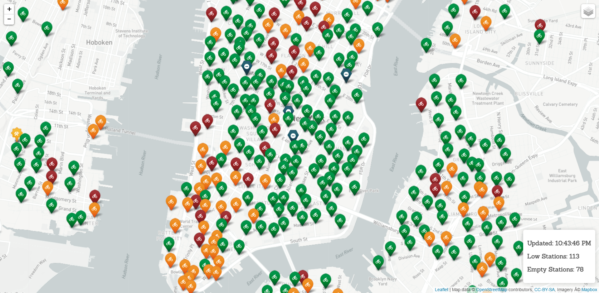

## 3.3 – Intro to CARTO & More Leaflet

### Overview
In this class, you will give students a hands-on introduction to CARTO. You will plot McDonald's location data, build a choropleth map of US population by state, and finally give students time to build their own CARTO maps. During the second half of the class, students will further develop their Leaflet skills by working on a mini-project mapping Citi Bike data.

##### Instructor Priorities:
* Students should understand the basics of creating maps with CARTO.
* Students should feel comfortable sourcing and importing different formats of geospatial data. 

##### Instructor Notes:
* A large portion of time is dedicated to students working on an in class assignment. During that time make sure you and TAs walk around the class and offer to help students who are stuck.

-------

### Class Objectives
* Learn the basics of creating maps with CARTO, including writing custom CSS and SQL queries.
* Demonstrate how different types of maps are better for visualizing different datasets.
* Gain Leaflet mastery by completing an in class project.

--------
### 0. Welcome Class
* Welcome the class, answer any quesitions students may have, and give an overview of what we will be doing today.

### 1. Instructor Do: Introduce CARTO (5 mins)
* Open the CARTO site in your browser (https://carto.com) and give students a brief overview of what CARTO is; a powerful platform for visualizing and expressing geospatial data. Go to the gallery (https://carto.com/gallery/) and show students some of the projects other people/organizations have built using CARTO.

	

### 2. Students Do: Create Account & Explore (5 mins)
* Instruct students to head over to https://carto.com and log in using their github profile, or create a new account. 
* Allow them to look through the gallery (https://carto.com/gallery/) for a few minutes while everyone gets their account set up.

### 3. Instructor Do: What is GeoJSON? (5 mins)

* Slack out the following link to students: `http://earthquake.usgs.gov/earthquakes/feed/v1.0/summary/all_hour.geojson` and open it in the browser.

* This is a GeoJSON document depicting all of the earthquakes that have taken place across the globe within the past hour.

* Explain that GeoJSON is an open standard format for representing simple geographical features, along with their non-spatial attributes, based on JSON.

	* Geographical features are represented by coordinates and can have other properties attached to them. 
	* Features can be a Point, LineString, Polygon, MultiPoint, MultiLineString, or MultiPolygon.
	* Sets of features are contained by FeatureCollection objects. 

* Demonstrate how the data the class is viewing contains a set of geographical coordinates, as well as a list of properties for each point. This list http://earthquake.usgs.gov/data/comcat/data-eventterms.php explains what each of the abbreviations mean. 

	
	(The GeoJSON for a single earthquake)

### 4. Everyone Do: Creating Our First CARTO Map (10 mins)
* Our first map is going to be a quick visualization of all of the McDonald's in the United States (circa the end of 2014). The data we are going to use is in the GeoJSON format we just learned about.

* Slack out the link to our data `https://raw.githubusercontent.com/gavinr/usa-mcdonalds-locations/master/mcdonalds.geojson`, and ask the class to follow along as you import the data into CARTO.

	* Click on `New Map` then `Connect Dateset`.
	* Put the McDonald's GeoJSON link `https://raw.githubusercontent.com/gavinr/usa-mcdonalds-locations/master/mcdonalds.geojson` into the blank space and press submit.
		* Note: There are many other types of file formats for storing geospatial data such as Shapefiles that CARTO supports.  
		* CARTO also allows you to automatically sync your data every hour/day/month so your maps can stay up to date if you have a dynamic dataset.

* Your map should be completed and it should look like this:

	

* Allow students to play around with the map for a bit. Fun fact: There are over 14 thousand McDonald's in the United States alone! 

* Open up the data view. Illustrate to students how CARTO has automatically pulled in all of the data from our GeoJSON file and organized it neatly into a table.

	

* Go back to map view and click on the `Wizards` category on the control panel on the right side of the screen. Explain that these are pre-formatted options that you can use to visualize your data. Go through the different wizards and show how each one of them changes how the data is visualized on your map.

	

* It's also worth noting that different types of maps are more useful for representing different datasets!

* Ask the class which of the wizard maps provides a useful visualization of our McDonald's data? 

	
	(Intensity)

	
	(Category)

### 5. Everyone Do: Customizing Our Map (10 mins)

* Now we are going to discuss customizing our map beyond the pre-built map wizards.

* Make sure you are on the `Simple` map option in the `Map Layer Wizard` menu, then show the CartoCSS editor. All the CSS pertaining to our map markers is kept in this window. Your CSS should look like this.

	

* Now go back and select a different visualization (cluster works well) in the Map Layer Wizard. Return to the CSS screen. The CSS has changed to reflect the new visuzliation. Or rather this new CSS is what has caused the change in our visualization. 
* All the wizard does is apply pre-written CSS to your map. With the CSS editor you can write all of your own CSS and come up with your own visualizations. CARTO uses CartoCSS which is similar in appeareance to regular CSS but is used for styling maps; you can read more about it here https://carto.com/docs/carto-engine/cartocss/.

	

* Have the students read up on CartoCSS properties https://carto.com/docs/carto-engine/cartocss/properties/ and take a few minutes to add custom styling to their map.

* CARTO allows you to add conditions and use variables in your styling. In the example below, if the user zooms out past a certian point the markers change to a different styling. 

	

* You can also reference a marker's properties when styling it. In this example, all of the McDonald's that don't have a playplace are styled differently on the map.

	

### 6. Instructor Do: CARTO SQL (5 mins)	

* Similar to how CARTO provides an area for you to write your own CSS, it allows you to make custome SQL queries on your data.

* CARTO uses a database called PostgreSQL, and a geospatial extension called PostGIS. PostGIS allows you to perform geospatial queries such as finding all data points that are within a given radius.

* Show the SQL tab from the control panel. Note that by default it uses a query that grabs all the data from our dataset.

	

* Now go to the filters tab. Select `Select a column to filter by` and choose `playplace`. We can see that there are 9,774 McDonald's without playplaces and 4,396 restautants with playplaces. Click on the `No` listing to filter them out. The map has been updated to now only show McDonald's that have playplaces. 

* Go back to the SQL tab and note the difference. The filter we created changed how we are grabbing data from our dataset. Just like the map layer wizard and CSS, we can create much more complicated filtering of our data by writing our own SQL queries.

	

* Note that we can create a new dataset from our SQL query which we can use to display on a new layer, or even create a new map all together!

### 7. Students Do: Geospatial SQL Queries (15 mins)

* Slack out the following instructions:

	* Instructions: 

		Using CARTO & PostGIS documentation as well as Google..
		1. Write a SQL query that will display all of the McDonald's in your state.
		2. Write a SQL query that will display only the closest 10 McDonald's to your location.
		3. Write a SQL query that will display all of the Mcdonald's within 25km of your location. 
		
* Note: This is tough!

### 8. Instructor Do: Go Over SQL Queries (5 mins)

	1. `SELECT * FROM mcdonalds_1 WHERE state IN ('NJ')`
	2. `SELECT * FROM mcdonalds_1 ORDER_BY the_geom <-> ST_SetSRID(ST_MakePoint(lon, lat),4326) ASC LIMIT 10`
	3. `SELECT * FROM mcdonalds_1 WHERE ST_DWithin(ST_Transform(CDB_LatLNG(40.486216, -74.451819), 3857), the_geom_webmercator, 25000 / cos(40.486216 * pi()/180))`

### 9. Instructor Do: Introduce Choropleth Activity (5 mins)

* We are now going to shift gears and work on a different map. Whereas the last map focused on visualizing point based data, our new map will visualize data as it applies to geographical regions.

* Open the finished choropleth map [Finished Choropleth](Activities/1-Choropleth/CARTO.html) and take a few minutes to show students what we are going to be making. This type of map is known as a choropleth - a thematic map in which areas are shaded or patterned in proportion to the measurement of the statistical variable being displayed on the map. In our case, we will be displaying population by US state.

	

* Also different about this activity is that our map will be an amalgamation of two different datasets.

	* The first dataset is GeoJSON that represents all of the state boundaries.
	* The second dataset is a CSV of population data from the US Census which we will use to enrich our geographical data.

### 10. Everyone Do: Build the Choropleth Map (15 mins)

* Slack out the URL `http://eric.clst.org/wupl/Stuff/gz_2010_us_040_00_5m.json` that contains the state boundry GeoJSON so students can follow along. 

* The first step in building our choropleth map is importing the data.
	* First import the state boundry data `http://eric.clst.org/wupl/Stuff/gz_2010_us_040_00_5m.json` and use it to create a new map.
	* It should look just like this:

	

	* Switch to the Data View. All of our data was successfully imported, but there isn't much to visualize. We are going to have to add another dataset.
	* Our second dataset comes from the US Census website - https://www.census.gov/popest/data/national/totals/2015/NST-EST2015-alldata.html
		* Click `Data` to download the `.CSV` file containing all of our Census data.
		* The `File layout` PDF contains all of the infomation to understand the spreadsheet that we just downloaded.
	* Navigate back to your CARTO dashboard, and then to your Datasets. Click `New Dataset` and then drag and drop your CSV into the designated area or `browse` for it.

* Now that we have our two datasets successfully uploaded it's time to combine them.
	* Go back to your blank map of the United States, and navigate to the Data View. In the bottom right corner click `merge datasets` and then `Column Join`. Here we will select `name` for both datasets, so that we can join them and match up our data.

	

* Now that our data is merged, we can see that our Data View now contains a lot more information. In addition to our population data, we have per-state data on a number of different subjects!

	

* To create our choropleth we follow the same steps as before. Navigate to the Map View, open the Map Layer Wizard, and select choropleth. The category that we want to visualize is popestimate2015 because it contains population data for the year 2015. In the `Column` drop down select popestimate2015.

* Note: We still haven't technically created a map out of our data yet. Go ahead and click `Visualize` in the upper right corner to turn our data into a proper map.

* Now that we have the bulk of our choropleth done give the students some time to polish their map. Have them..
	* Add infowindows on Click and Hover
	* Give their map a title and edit the meta data
	* Spruce up the legend
	* Edit the map options

### 11. Students Do: Add Your Map to a Webpage (5 min)

* We have a completed map but it's still just sitting in the CARTO editor. Have students click `PUBLISH` in the upper right corner and then follow the CartoDB.js method to deploy their map to a blank HTML page.

### BONUS Students Do: Create Your Own Map

* If there is time left before break, task the students with searching out their own dataset and visualizing it in an interesting or insightful way using CARTO. Stop class a few minutes before break and ask a few students to share what they built.

* Some sources where students can find GeoData:
	* Data.gov - https://www.data.gov/
	* NYC Open Data - https://nycopendata.socrata.com/
	* The Humanitarian Data Exchange - https://data.humdata.org/
	* Locating Geospatial Data - https://carto.com/docs/tutorials/simple_points_map/#locating-geospatial-data
	* The CARTO Data Library

	

* If they are stuck, tell them to look at the CARTO Gallery for inspiration https://carto.com/gallery/.

### BREAK (40 mins)

### 12. Students Do: Citi Bike Revisited (80 mins)

* Answer any questions students might have had about the last section before moving on.

* The rest of the time in this class is going to be devoted to working on a mini-project in leaflet. Open up the sample file [CitiBike](Activities/2-CitiBike/CitiBike.html) and show them what they are going to be working on. We are revisiting Citi Bike data, but looking at it in a new light. 

* Students will have to utilize the Citi Bike API to build a map of all of the Citi Bike stations in the New York area.
* Important things to note:
	* Map markers should be split into 5 different categories: Coming Soon, Out of Order, Empty, Low Bikes (less than 5), and the rest.
	* Each marker group should be on its own layer which can be toggled on or off.
	* Students should utilize a leaflet plugin to display custom icons instead of normal markers.
	* Markers should have popups when clicked, and should display the station name, capacity, and number of bikes currently in stock.
	* These should be a legend which displays station information.
	* **BONUS** - Have your map provide up-to-the-minute data about bike availability.

* If students finish early have them brainstorm ways to add additional functionality to their map. 
	* Add geolocation and make it mobile friendly so people can use it on the go? Deploy it online.

### 13. Instructor Do: Go Over Assignment (10 mins)

* Slack out the solution [Citi Bike](Activities/2-CitiBike).

* Go over the assignment!

	

-------

### Copyright 
Coding Boot Camp (C) 2016. All Rights Reserved.